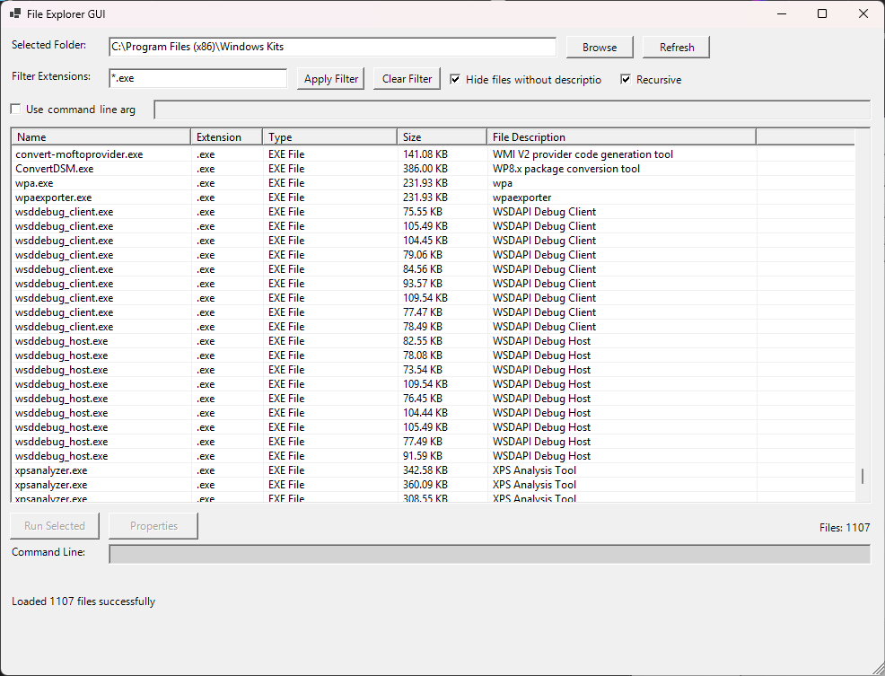
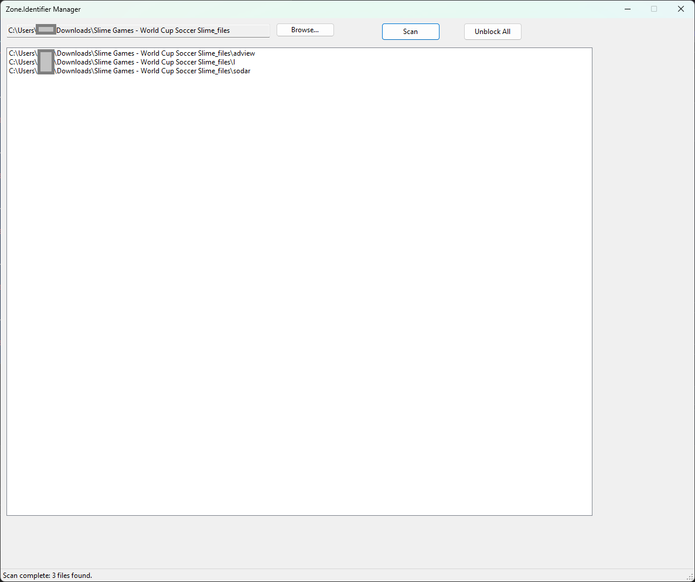
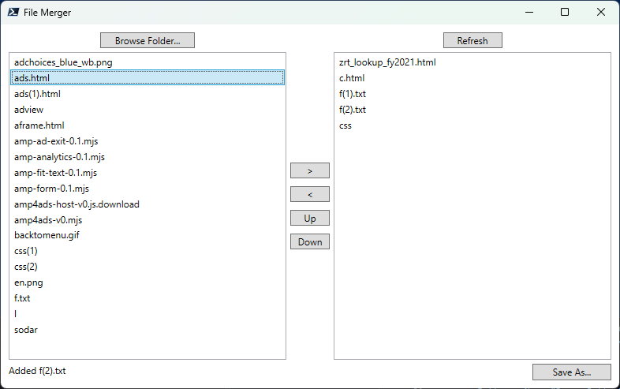
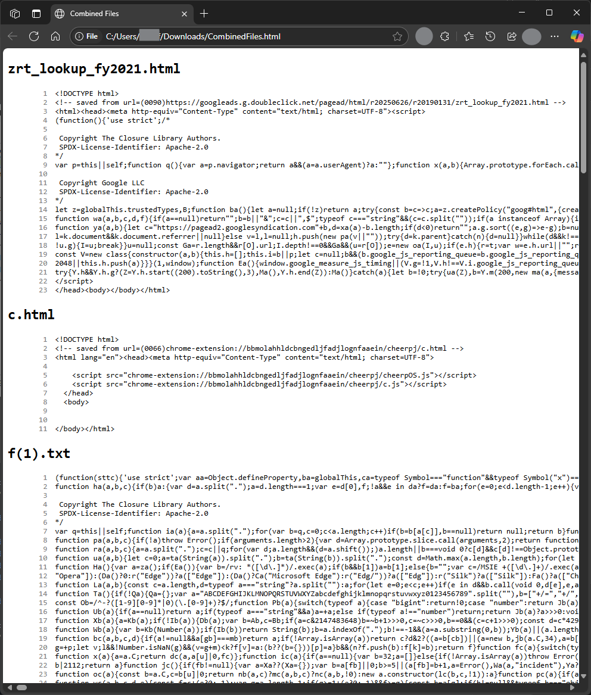

## Powershell

<table>
  <tr>
    <th align="left">Script &amp; Description</th>
    <th align="center">Preview</th>
  </tr>

  <tr>
    <td valign="top">
      
### [view exe descriptions gui](pwsh/fileexplorer.ps1)
* used to browse files in a directory to view their File Descriptions.  
* helpful for skimming through windows exe files

    <td valign="top">
  

</tr>
  <tr>
    <td valign="top">

### [unblock with gui finder](pwsh/unblockgui.ps1)

- searches recursively for files that are blocked
- unblocks files when you click
  </td>
  <td valign="top">
  

    </tr>

    <tr>
      <td valign="top">

### [concat2html](pwsh/Move-FilesOlderThan.ps1)

- select multiple files and sort on right side to export a single html with each file shown sequentially and with line numbers.
- intended use case is for aggregating multiple smaller text files in order to meet file limits for ai.
- not recursive

    </td>
    <td valign="top">

 

  </tr>

</table>
